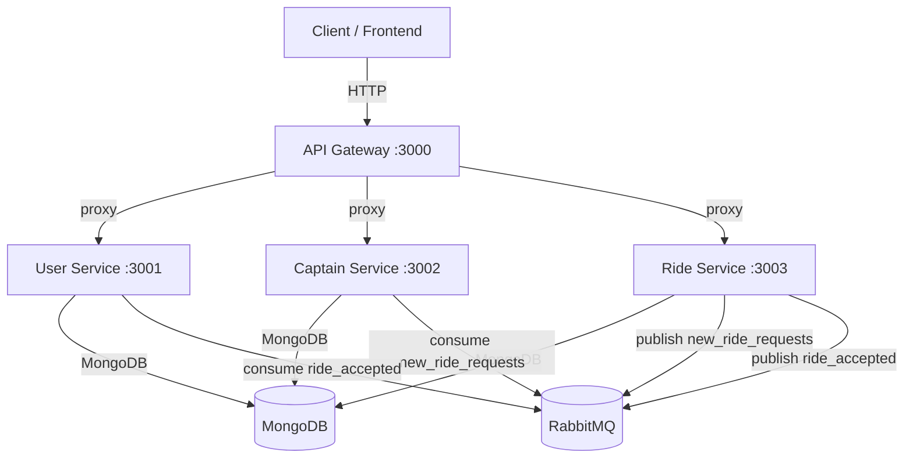
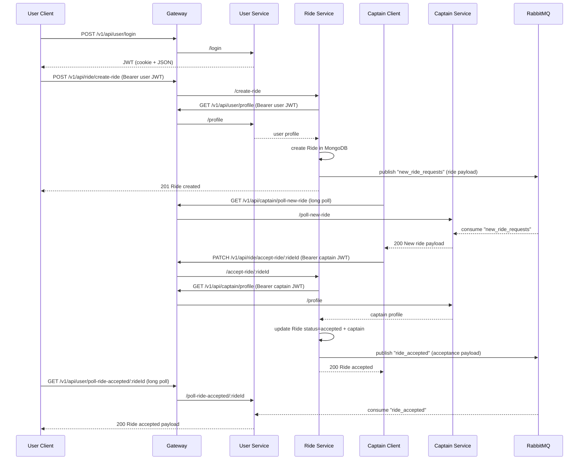

# Uber System (Node.js Microservices) — Project Deep Dive

This repository implements a small “Uber-like” backend using **Node.js microservices**.

The system is split into four services:

- **gateway** — API Gateway (single entrypoint for clients)
- **user** — user auth + profile + “ride accepted” notifications
- **captain** — captain auth + profile + availability + “new ride request” notifications
- **ride** — ride creation + acceptance + publishes ride events

It uses **MongoDB** for persistence and **RabbitMQ** for service-to-service event delivery.

---

## 1) Big Picture

### 1.1 What this project demonstrates

- Microservice separation by domain (users, captains, rides)
- Central gateway routing (`express-http-proxy`)
- JWT-based authentication
- Token invalidation via blacklist collection (logout)
- Async events using RabbitMQ queues
- “Push-like” UX implemented with **long polling** (no WebSockets)

### 1.2 Tech stack

- Node.js (ES Modules — `"type": "module"`)
- Express `^5.x`
- MongoDB + Mongoose
- RabbitMQ + `amqplib`
- JWT (`jsonwebtoken`)
- Password hashing (`bcrypt`)
- Logging (`morgan`)
- HTTP-to-service auth verification (`axios` in ride service)

---

## 2) Repository Structure

At the repo root you’ll find four service folders:

```
uber-system/
  gateway/
  user/
  captain/
  ride/
```

Each “real” service (user/captain/ride) follows a consistent shape:

- `server.js` — process startup + DB connect + graceful shutdown
- `src/app.js` — Express app assembly (middleware + routes)
- `src/config/config.js` — loads env + validates required vars
- `src/config/db.js` — MongoDB connection via Mongoose
- `src/routes/*.routes.js` — route definitions
- `src/controller/*.controller.js` — request handlers
- `src/middleware/*.middleware.js` — auth and logging
- `src/models/*` or `src/model/*` — Mongoose schemas
- `src/service/rabbit.js` — RabbitMQ connect + publish/subscribe helpers

The gateway service is smaller:

- `app.js` — express server that proxies requests to the services
- `middleware/morgan.middleware.js` — console + file logging

---

## 3) Runtime Topology

### 3.1 Default local ports

The gateway proxies to hard-coded local ports:

- Gateway: `http://localhost:3000`
- User service: `http://localhost:3001`
- Captain service: `http://localhost:3002`
- Ride service: `http://localhost:3003`

### 3.2 External dependencies

- MongoDB (one instance is enough for all services)
- RabbitMQ (one instance is enough for all services)

---

## 4) Architecture & Data Flow

### 4.1 Request routing (API Gateway)

The gateway acts like a reverse proxy:

- `/v1/api/user/*` → `http://localhost:3001/*`
- `/v1/api/captain/*` → `http://localhost:3002/*`
- `/v1/api/ride/*` → `http://localhost:3003/*`

**Important:** each downstream service mounts its router at `/`, so the gateway path prefix is the “versioned API namespace”.

### 4.2 Ride flow overview

This system uses **RabbitMQ queues** to send ride events between services:

- `ride` publishes `new_ride_requests` when a user creates a ride
- `captain` consumes `new_ride_requests` and exposes a long-poll endpoint so captains can “receive” new rides
- `ride` publishes `ride_accepted` when a captain accepts a ride
- `user` consumes `ride_accepted` and exposes a long-poll endpoint so users can “receive” acceptance

### 4.3 Mermaid diagrams

#### Service diagram



#### Sequence: create → accept → notify



---

## 5) Authentication & Authorization

### 5.1 JWT signing

- User tokens and captain tokens are both signed using `JWT_SECRET`.
- The **ride service also verifies** tokens using the same `JWT_SECRET`, so all three services must share the same secret.

### 5.2 Where tokens come from

User service sets cookies:

- `user_token` (role-specific)
- `token` (generic, for backwards compatibility)

Captain service sets cookies:

- `captain_token` (role-specific)
- `token` (generic, for backwards compatibility)

**Recommendation:** use `Authorization: Bearer <token>` for authenticated calls. This avoids cookie-name collisions when both a user and captain are logged in from the same browser.

### 5.3 Logout + token blacklist

Both user and captain services support logout by storing the JWT in MongoDB (`BlacklistToken` collection). Auth middleware checks if the token exists in the blacklist.

### 5.4 Ride service “distributed auth”

The ride service does two checks for protected endpoints:

1. Verifies JWT signature (local check using `JWT_SECRET`)
2. Calls the upstream service via the gateway:
   - user endpoints call `GET /v1/api/user/profile`
   - captain endpoints call `GET /v1/api/captain/profile`

This ensures:

- Tokens are valid
- The user/captain still exists and is not blacklisted

---

## 6) Data Models (MongoDB)

These are the Mongoose schemas used.

### 6.1 User (`User` collection)

Fields:

- `name`: string (required)
- `email`: string (required, unique)
- `password`: string (required, bcrypt-hashed)
- `createdAt`, `updatedAt`: timestamps

### 6.2 Captain (`Captain` collection)

Fields:

- `name`: string (required)
- `email`: string (required, unique)
- `password`: string (required, bcrypt-hashed)
- `isAvailable`: boolean (default `false`)
- `createdAt`, `updatedAt`: timestamps

### 6.3 Ride (`Ride` collection)

Fields:

- `user`: ObjectId (required)
- `captain`: ObjectId (optional)
- `pickup`: string (required)
- `destination`: string (required)
- `status`: enum (`started | requested | accepted | completed`), default `requested`
- `createdAt`, `updatedAt`: timestamps

### 6.4 Blacklist Token (`BlacklistToken` collection)

Used in both user and captain services.

Fields:

- `token`: string (required)
- `createdAt`: date
- timestamps

---

## 7) RabbitMQ Messaging

### 7.1 Queues

| Queue | Producer | Consumer | Purpose |
|------|----------|----------|---------|
| `new_ride_requests` | ride | captain | deliver newly created rides to captains |
| `ride_accepted` | ride | user | notify a user that a ride was accepted |

### 7.2 Payload shapes

#### `new_ride_requests`

Published right after a ride is created. Payload is the saved ride document (includes `_id`, `user`, `pickup`, `destination`, `status`, timestamps).

#### `ride_accepted`

Published after an atomic “accept” update. Payload looks like:

```json
{
  "rideId": "...",
  "userId": "...",
  "captain": { "id": "...", "name": "...", "email": "..." },
  "status": "accepted",
  "pickup": "...",
  "destination": "...",
  "acceptedAt": "..."
}
```

---

## 8) Long Polling (Notifications)

There is no WebSocket/SSE layer. Instead:

- captains call `GET /poll-new-ride` and the captain service blocks the response until:
  - a `new_ride_requests` message arrives, or
  - the timeout expires

- users call `GET /poll-ride-accepted/:rideId` and the user service blocks the response until:
  - a matching `ride_accepted` message arrives, or
  - the timeout expires

### 8.1 Timeouts

Both endpoints support `timeoutMs` as a query param:

- default: `25_000` ms
- clamped to: `1_000` → `60_000` ms

### 8.2 In-memory queues (important limitation)

Pending events and waiting clients are stored in memory (`Array`/`Map`). That means:

- if a service restarts, pending events are lost
- it’s intended for learning/dev, not production push delivery

---

## 9) HTTP API Reference (via Gateway)

Base URL (local): `http://localhost:3000`

### 9.1 User API (`/v1/api/user`)

| Method | Path | Auth | Description |
|--------|------|------|-------------|
| POST | `/v1/api/user/register` | No | Register a new user |
| POST | `/v1/api/user/login` | No | Login user |
| GET | `/v1/api/user/logout` | Yes | Logout + blacklist token |
| GET | `/v1/api/user/profile` | Yes | Get user profile |
| GET | `/v1/api/user/poll-ride-accepted/:rideId` | Yes | Long poll ride acceptance |

Request/response notes:

- Register/login return `{ token, data }` and also set cookies.
- Use `Authorization: Bearer <user_token>` for protected endpoints.

### 9.2 Captain API (`/v1/api/captain`)

| Method | Path | Auth | Description |
|--------|------|------|-------------|
| POST | `/v1/api/captain/register` | No | Register a captain |
| POST | `/v1/api/captain/login` | No | Login captain |
| GET | `/v1/api/captain/logout` | Yes | Logout + blacklist token |
| GET | `/v1/api/captain/profile` | Yes | Get captain profile |
| PATCH | `/v1/api/captain/toggle-availability` | Yes | Toggle `isAvailable` |
| GET | `/v1/api/captain/poll-new-ride` | Yes | Long poll new rides |

### 9.3 Ride API (`/v1/api/ride`)

| Method | Path | Auth | Description |
|--------|------|------|-------------|
| POST | `/v1/api/ride/create-ride` | User | Create a ride request (publishes event) |
| PATCH | `/v1/api/ride/accept-ride/:rideId` | Captain | Accept a ride request (publishes event) |

Ride service auth behavior:

- Validates tokens locally using `JWT_SECRET`
- Calls upstream profile endpoints via `BASE_URL` (usually the gateway)

---

## 10) Observability (Logs)

All services use `morgan`:

- **Console logs**: `morgan("dev")`
- **File logs**: `logs/access.log` under each service folder (created automatically)

---

## 11) Shutdown & Reliability

Each main service uses a graceful shutdown handler:

- captures `SIGINT` / `SIGTERM`
- closes HTTP server
- closes Mongo connection
- forces exit if shutdown takes too long

---

## 12) Known Limitations / Notes

- Long polling state is kept in memory (restarts lose pending events)
- Gateway routes and ports are hard-coded in `gateway/app.js`
- Tokens are set as cookies without explicit security flags (consider `httpOnly`, `secure`, `sameSite` for production)
- No matching algorithm yet (all captains receive ride requests)
- Ride lifecycle beyond `accepted` (e.g., start/complete) is not implemented

---

## 13) How to run

See `run.md` for step-by-step setup and an end-to-end test flow (register → create ride → accept → notify).
